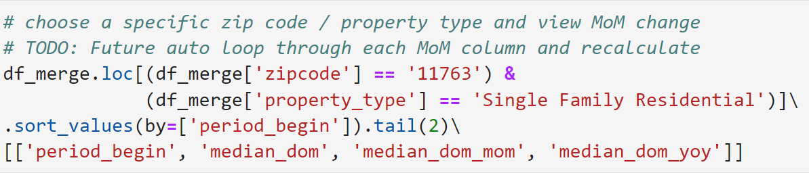

# New York Housing Market - Redfin

*How do you know if it is a good time to buy or sell real estate?*

There are numerous factors that contribute to the health of a real estate market including median sale price, homes sold, new listings, median days on market, price drops, etc.

The housing market data is stored in the MLS (multiple listing services). Access to the MLS requires a real estate license for that particular region.

*How do we get monthly housing data if we are not licensed agents?*

We can use online brokerages, such as Redfin, that consolidate housing market data nationwide on a monthly basis down to the zip code level.

Redfin is a real estate brokerage, meaning we have direct access to data from local multiple listing services (MLS), as well as insight from our real estate agents across the country. That’s why we’re able to use the earliest and most reliable data on the state of the housing market. Using these tools, we can visualize and download housing market data for metropolitan areas, cities, neighborhoods and zip codes across the nation.

The first part of this project we will get housing market data for a list of zip codes using Python. 

The data will then be visualized in Tableau.

---

**Problem Statement**

We need to answer whether the housing market is crashing or not?

We understand housing market data is most useful at the zip code level, therefore we need up-to-date data for all zip codes in our districted county.

The housing market data will include features such as sale price, homes sold, new listings, days on market, and price drops.

The data should be updated on weekly basis and be computed on a 12-week window.

**This will allow us to gauge whether our housing market is shifting to a buyer’s or seller’s market!**

---

## Data Source

We will use the Zip Code Region Data from Redfin’s Data Center.
    
    'https://redfin-public-data.s3.us-west-2.amazonaws.com/redfin_market_tracker/zip_code_market_tracker.tsv000.gz'

---    
    
## 1. Import Libraries

First, import the required libraries.

    - pandas
    - datetime
    - time
    - warnings
    
---    
    
## 2. Data
Read in Housing Data File

The Redfin monthly housing data file is broken out into seven regions: National, Metro, State, County, City, Zip Code, and Neighborhood.

For our use case, we will focus on the zip code dataset.

To locate the file navigate to Redfin’s Data Center. 

https://www.redfin.com/news/data-center/

Right-click "Zip Code" to locate the link address.

---

## 3. Data Loading

In the notebook, we will read the file within memory. This allows us to read our file from within our environment without having to download the file locally.

The zip code dataset is in a tsv000.gz format. We use pandas to read in the file from our URL.
we can use the pandas read_csv() function to accomplish this.

The file taakes nearly 6 minutes to load! 
The dataset includes: **6.6+ million rows of data and 50+ columns!**

---

Below is the comprehensive list of the features in our dataset:

**median_sale_price:** The final home sale price covering all homes with a sale date during a given time period where 50% of the sales were above this price and 50% were below this price.

**median_list_price:** The most recent listing price covering all homes with a listing date during a given time period where 50% of the active listings were above this price and 50% were below this price.

**median_ppsf:** The median list price per square foot of all active listings.

**homes_sold:** Total number of homes with a sale date during a given time period.

**pending_sales:** Total homes that went under contract during the period. Excludes homes that were on the market longer than 90 days.

**new_listings:** Total number of homes with a listing added date during a given time period.

**inventory:** Total number of active listings on the last day a given time period.

**months_of_supply**: When data are monthly, it is inventory divided by home sales. This tells you how long it would take supply to be bought up if no new homes came on the market.

**median_dom:** The number of days between the date the home was listed for sale and when the home went off-market/pending sale covering all homes with an off-market date during a given time period where 50% of the off-market homes sat longer on the market and 50% went off the market faster. Excludes homes that sat on the market for more than 1 year.

**avg_sale_to_list:** The mean ratio of each homes sale price divided by their list price covering all homes with a sale date during a given time period. Excludes properties with a sale price 50%

**sold_above_list:** The percent of homes sales with a sale price greater than their latest list price covering all homes with a sale date during a given time period. Excludes properties with a sale price 50% above the listing price or with a sale price 50% below the list price.

**price_drops:** How many listings dropped their price in a given time period.

**off_market_in_two_weeks:** The total number of homes that went under contract within two weeks of their listing date.

Source: Redfin Data Center Metrics Definitions
https://www.redfin.com/news/data-center-metrics-definitions/

---

Let’s filter down our dataset on a state of interest. Here we select "NY" for New York.

*This reduces our dataset by ~93%! Our dataset is now much easier to work with.*

---

## 4. Data Merging

For our use case, we will select a handful of zip codes to review. Therefore, we read in the geography dataset from Github to map zip code, county, and state.

It is best practice in data analysis to start with a sample set before applying logic to an entire dataset.

For our analysis, let’s imagine our market is Suffolk County, on Long Island in New York. Therefore, we only want to focus in on counties that include and surround the city.

Now we filter down the geography dataset to only include zip codes within the counties of interest.

Remove the invalid zip codes to produce a clean dataset of geographies within our interested counties.

Next, we add a feature zipcode from our housing dataset to extract zip code from the region field.

This allows us to join our housing dataset to our geography dataset of zip codes we care about.

---

## 5. Data Cleansing

Best practice in data analysis is to review and sample data at the granular level to confirm validity.

Here we filter on a single zip code and property type.

---

## 6. Features

There are three features that we add to our dataset:

**latest_period:** Flag for the latest time period in our dataset.
**city:** Drop duplicate columns from the DataFrame merge
**median_dom_mom:** Recalculating median days on market MoM to fix bad data.

--- 

### We have officially cleansed and filtered our dataset that is ready to be analyzed through visualizations!

### Tableau Visualization :

https://public.tableau.com/app/profile/richie6436/viz/RealEstateMarketAnalysis_16694993803010/Dashboard1?publish=yes

---

## Conclusion

Redfin’s free housing market dataset is an incredible resource to analyze data at the zip code level.

Using housing market datasets alongside visualization tools like Tableau can provide insight on how your real estate market is performing and what future trends exist.